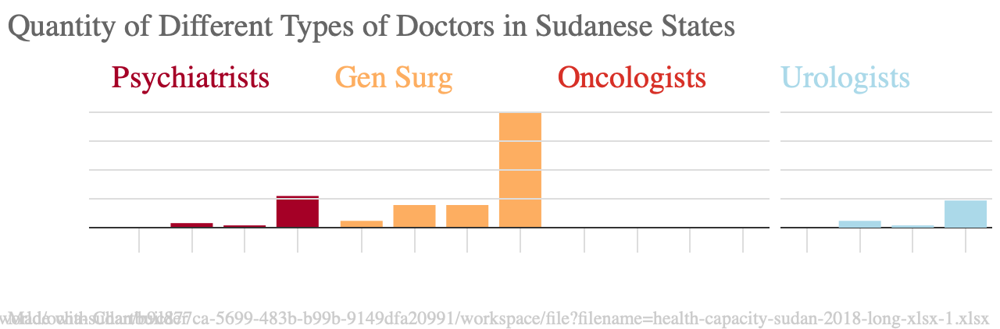

## About Me
My name is Lexington Poole. I am 20-years-old and from the suburbs of Atlanta, Georgia. I am a junior at Lehigh University.

I declared a double major in Cognitive Science and Journalism the spring semester of my sophomore year. I am on Lehigh's softball team. In my freetime I make college lifestyle videos on YouTube.

## Personal Website
[Link to My Instagram](https://www.instagram.com/lexijpoole/)

## Inserted Image
My favorite drink is a matcha latte with almond milk and is pictured below
 

## Using Canva to Illustrate Lehigh Undergraduate Student Data
This infographic consist of data relating to Lehigh University's undergraduate population. This data includes breakdowns of undergraduate residency, full time and part time status, enrollment throughout offered undergraduate programs and gender ratio. This data was compiled by the Office of Institutional Research and Strategic Analysis and can be found [here](https://oirsa.lehigh.edu/sites/oirsa.lehigh.edu/files/LUprofile_2019.pdf)

## Creating an Inforgraphic
Sexual assault is a large issue within our contemporary society. This infographic is a breakdown of data in regards to the victims of these violent acts. This data was compiled by RAINN, an organization that provides helpful resources for victims of sexual assault. The data I used for this infographic can be found [here](https://www.rainn.org/statistics/victims-sexual-violence). Because it is hard to get statistics of sexual assualt due to them always changing and the scarcity of victims coming forward, RAINN sourced this compiled data from multiple reliable sources and datasets including the Department of Justice, the Department of Defense, and more.

## Timeline Project
<iframe src='https://cdn.knightlab.com/libs/timeline3/latest/embed/index.html?source=1aoxFGDn-FEwNF50fjcBdZRPQPTqwHin2NVtiYAx2Ne0&font=Default&lang=en&initial_zoom=2&height=650' width='100%' height='650' webkitallowfullscreen mozallowfullscreen allowfullscreen frameborder='0'></iframe>

## Bar Chart Project
 This bar chart uses data from [this dataset](https://data.world/ocha-sudan/b9c877ca-5699-483b-b99b-9149dfa20991/workspace/file?filename=health-capacity-sudan-2018-long-xlsx-1.xlsx) to showcase the different quanitities and types of doctors in various Sudanese states.

## Line Chart Project

This line chart uses data from [this dataset](https://data.world/fivethirtyeight/marriage/workspace/file?filename=divorce.csv) to show a visual representation of divorce rates over the years. Specifically this chart focuses on the difference in divorce rates based on socioeconomic class level from poor, to middle, to rich. This data shows that there is a higher rate of divorce as the years go on amongst couple who are of a lower socioeconomic level.

## Google My Map
<iframe src='https://www.google.com/maps/d/u/3/embed?mid=1DrmAU9Gu7k1mnXIXCGkrVDGyuBTUDKkG&ehbc=2E312F' width='640' height='480'></iframe>
This map showcases data from the top five best ranked cities to live in. The data that was used to determine these rankings include metro population, average annual salary, average temperatures, median age, and so much more. This data was taken from [this dataset by Ben Jones](https://data.world/dataremixed/125-us-cities-ranked-2019) of 125 US cities that weere ranked in 2019.

## Interactive Data Visualization

<object class='tableauViz' width='1280' height='684' style='display:none;'><param name='host_url' value='https%3A%2F%2Fprod-useast-a.online.tableau.com%2F' /> <param name='embed_code_version' value='3' /> <param name='site_root' value='&#47;t&#47;lexingtonpooledatajournalism' /><param name='name' value='InteractiveDataVisualization&#47;Dashboard1' /><param name='tabs' value='yes' /><param name='toolbar' value='yes' /><param name='showAppBanner' value='false' /></object>

## Interactive Data Visualization 2
https://prod-useast-a.online.tableau.com/#/site/lexingtonpooledatajournalism/workbooks/496415/views
